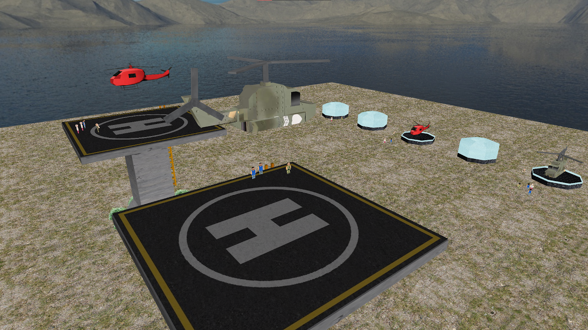
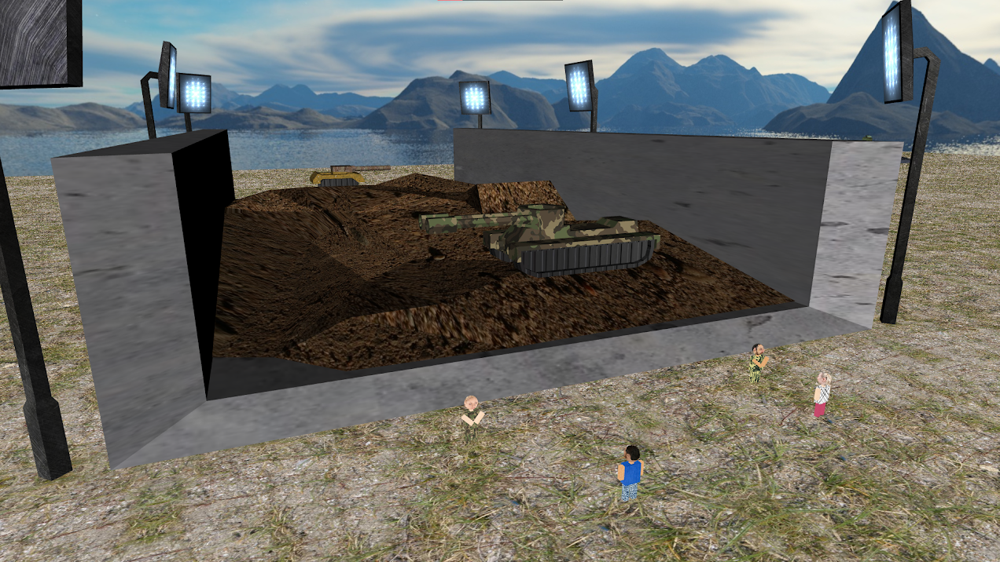
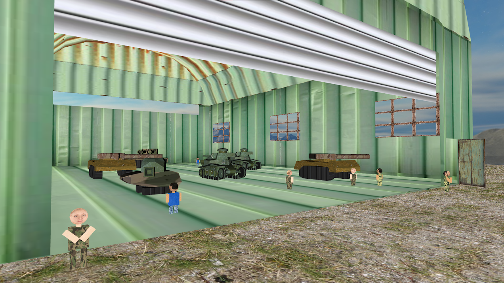
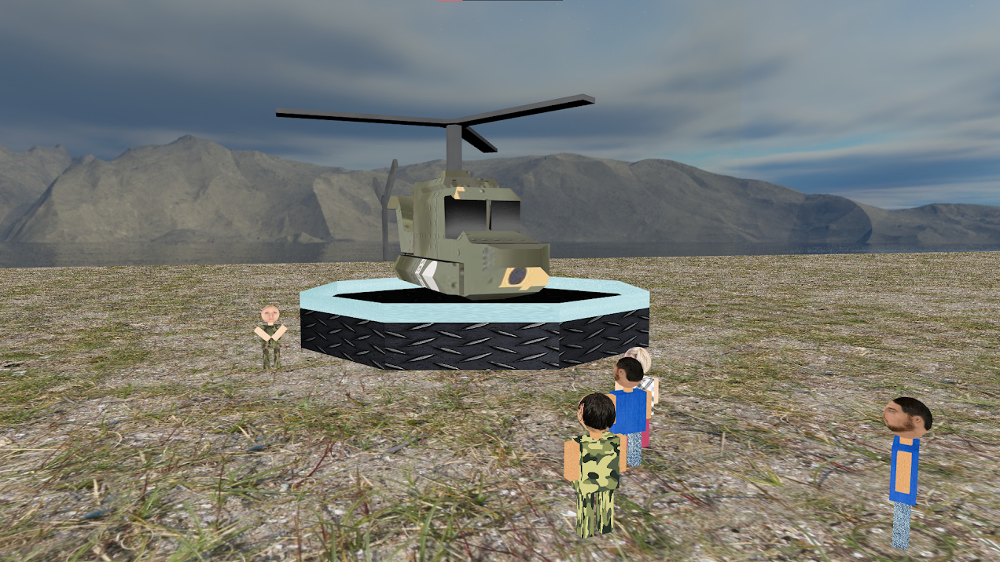

# General information

This project was realized for G3D (3D Graphics) subject, 2nd year, first semester (2019-2020) at Computer Science College of Transylvania University of Brașov, Romania.

Authors:
- Teodor Mihăescu
- Alexandra Manole
- Alexandru Popa

## Purpose
The purpose of the project was to realize an OpenGL 3D environment with the theme: "Military field with tanks, helicopters and hangars". Different functionalities were required, like: loading, texturing and animating a 3D model, user interaction, light, shadow, etc.
Our team managed to implement most of the required functionalities except for external lighting (Phong) and shadows.
We also implemented some bonus functionalities like: skybox, or human UV sphere models.

## Showcase materials
For a visualization of the project results, you can watch [this video](https://youtu.be/StB1KxYEAZE).

For a short presentation you can access [this link](https://docs.google.com/presentation/d/1sORuB591ywmk1yvS6xr9P_k4pkaKeVeLsm22vVvIaZA/edit?usp=sharing)(RO).

Some screenshots of the rendering:
|
:------------------------:|:------------------------:
|

## Demo
For a quick demo, you can also download and extract [this archive](https://drive.google.com/file/d/1U0_sT9QCoHk46g7v1TqJeYrIsQ4mWcU8/view?usp=sharing) and run one of the following:
- Release1080p.exe
- Release720p.exe

> Running the release demos, should take ~8 seconds to load, depending on your system, please wait.

> Running the debug demos take much longer thus are not recommended.

## User guide
Controls:
- W, A, S, D - Move
- ESC - Exit

## Implementation
For this project we used technologies like:
- **Visual Studio 2017**:  IDE
- **Blender**: to implement or modify some of the 3D elements
- **OpenGL libraries**:
	- **glew**: for OpenGL function pointers
	- **glfw**: for creating and managing OpenGL contexts (like windows)
	- **SDL**: for different hardware abstractions and event-handling functionalities
	- **glm**: for math
